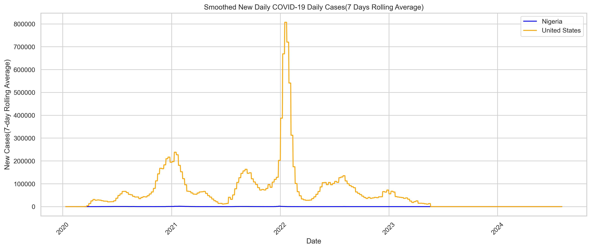
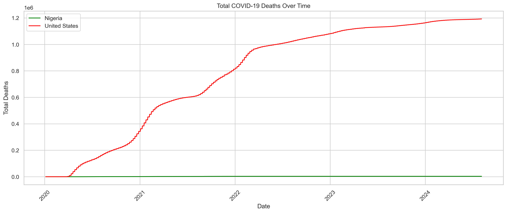
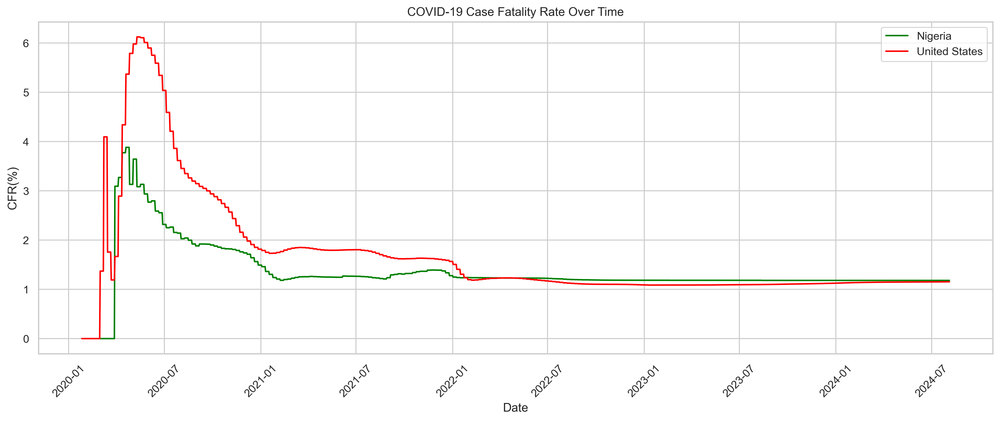
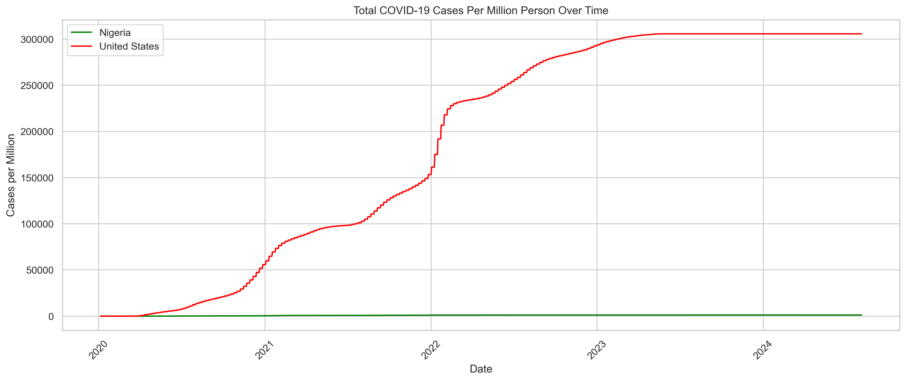

# 🦠 COVID-19 Trend Analysis – Nigeria vs United States

This project presents a comprehensive analysis and visualization of COVID-19 trends in **Nigeria** and the **United States**, using Python and real-world data from [Our World in Data](https://ourworldindata.org/coronavirus).

The goal is to:
- Understand how the pandemic progressed in both countries
- Compare key indicators such as total cases, deaths, and fatality rates
- Generate useful insights through clear, smoothed visualizations

## 🔧 Tools Used
- Python 🐍
- Jupyter Notebook 📓
- Pandas
- Matplotlib
- Seaborn

## 📊 Analysis Highlights

### 1. 📈 Smoothed New COVID-19 Cases Over Time
Smoothed 7-day rolling average of new cases to reveal long-term trends.



### 2. 💀 COVID-19 Deaths Over Time
Comparison of total deaths in Nigeria and the US over time.



### 3. 📉 Case Fatality Rate Over Time
Shows how deadly the virus was during different periods by comparing deaths to confirmed cases.



### 4. 📊 Cases per Million People
Standardizes case counts relative to each country's population for fair comparison.



## 📁 Project Structure

```
covid19_trend_analysis/
├── covid_trend_analysis.ipynb
├── owid-covid-data.csv
├── README.md
├── images/
│   ├── smoothed_cases.png
│   ├── deaths_trend.png
│   ├── cfr_trend.png
│   └── cases_per_million.png
```

## 🚀 How to Run

1. Clone the repository  
   ```bash
   git clone https://github.com/SilasBello/covid-trend-analysis.git
   cd covid-trend-analysis
   ```

2. Install dependencies (optional):
   ```bash
   pip install pandas matplotlib seaborn
   ```

3. Open the notebook in Jupyter:
   ```bash
   jupyter notebook covid_trend_analysis.ipynb
   ```

## 📌 Data Source
- [Our World in Data – COVID-19 Dataset](https://ourworldindata.org/coronavirus)

## ✅ Status
Project is complete and ready for presentation. Future improvements may include:
- Adding prediction models
- Expanding to other countries or continents

## 🙌 Author
Silas Bello Olayoriju  
[GitHub](https://github.com/SilasBello)
