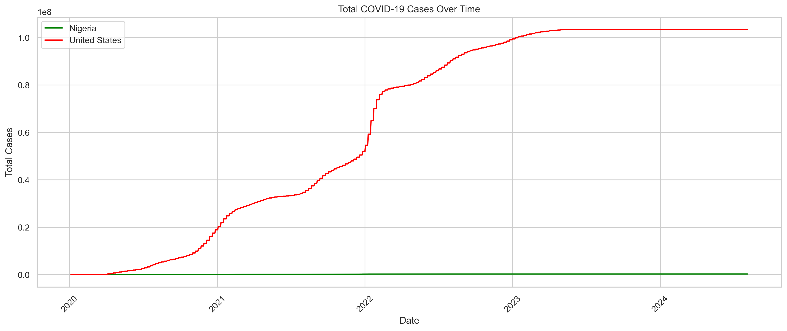
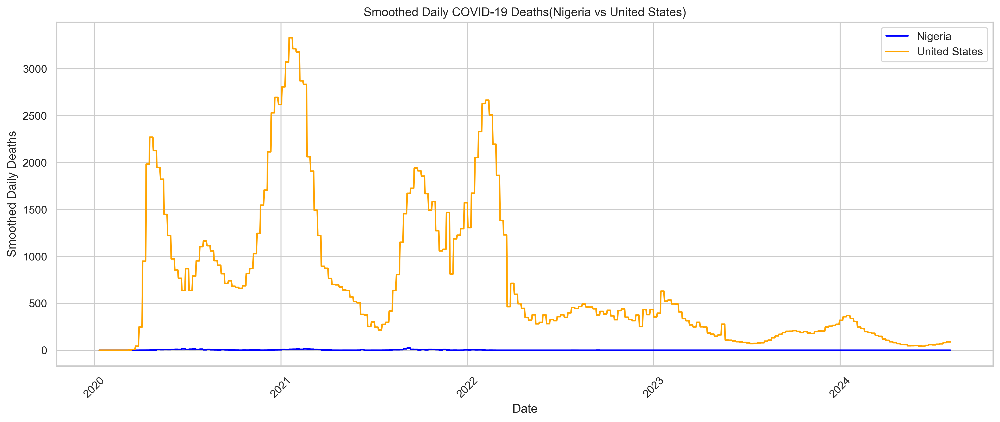
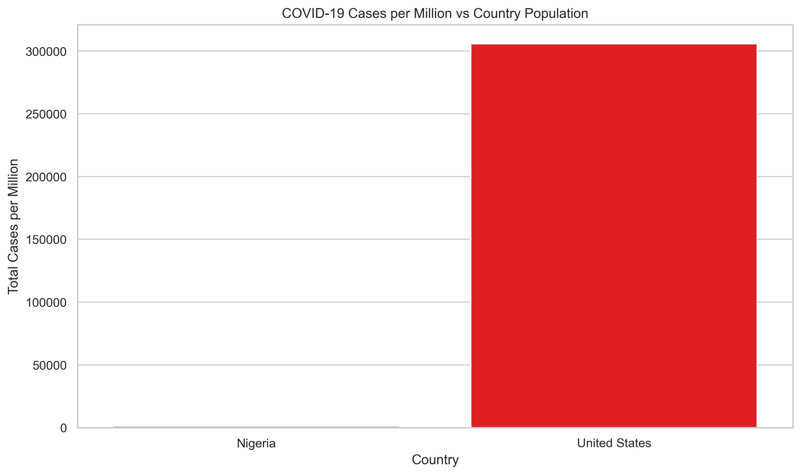

# 🦠 COVID-19 Trend Analysis – Nigeria vs United States

A data-driven analysis and visualization of COVID-19 trends in **Nigeria** and the **United States**, using Python (Pandas, Seaborn, Matplotlib).  
This project compares how the pandemic evolved across both countries, with a focus on cases, deaths, and severity over time.

---

## 📊 Key Visualizations

### 1. Total COVID-19 Cases Over Time

### 2. Smoothed Daily New Cases (7-day average)

### 3. Smoothed Daily New Deaths (7-day average)

### 4. Total COVID-19 Deaths Over Time

### 5. Case Fatality Rate (CFR) Over Time

### 6. Total Cases Per Million People

### 7. Cases Per Million vs Population (Final Comparison)

---

## 🛠 Tools Used

- Python 3.x (via Anaconda)
- Jupyter Notebook
- Pandas
- Seaborn
- Matplotlib
- Dataset: [Our World In Data – COVID-19](https://ourworldindata.org/covid-deaths)

---

## 📁 Project Structure

=======
# covid-trend-analysis
COVID-19 analysis using Python for Nigeria and the US
